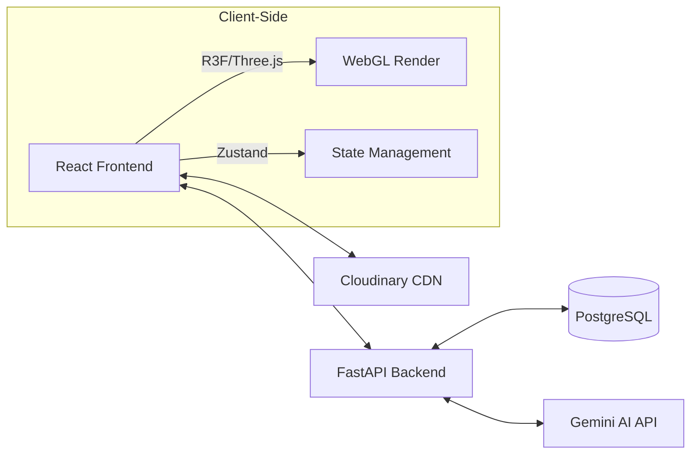

# Travel Globe: A Full-Stack WebGL Ecosystem for Narrative Mapping and Sentiment Analysis

  
  
  
  
  
    
  

---

## 1. Project Overview

An Interactive 3D visualization platform that bridges the gap between **Geospatial Data Science**, **Affective Computing**, and **Digital Storytelling**.

**Live Demo**: https://travel.shiyun-liu.com/

**Purpose:**  Technical portfolio for applications of master programmes in Italy

## 2. Demo Account

To help reviewers explore the application quickly, a demo account is provided:

- Username: demo01
- Password: Demo1234!

Note:
- This account is read-only for demonstration purposes.

  Please feel free to create your own account for full functionality.

- The backend service is hosted on a free instance.

  Please allow **up to 1 minute** for the initial spin-up if the app seems unresponsive.

## 3. Key Features

### **3.1 Interactive 3D Geospatial Globe**

- Visualize travel history on a high-fidelity 3D globe.
- **Phyllotaxis Clustering**: Resolves overlapping data points via a spiderfy expansion system.
- **Dynamic Animation**: Sine-wave "breathing" effects for organic interaction.

### **3.2 Sentiment-Driven "Mood Sphere"**

- A generative WebGL environment where travel diaries are transformed into emotional particles.
- **Visual Mapping**: AI-extracted sentiment vectors dictate color (HSL), scale, and movement patterns.

### **3.3 AI Travel Assistant & Diary Pipeline**

- **One-Click Diary**: Converts raw thoughts into structured JSON (Title, Location, Mood).
- **Context-Aware Chat**: Markdown-supported assistant for itinerary planning.

### **3.4 Robust Full-Stack Architecture**

- **CRUD & Auth:** Secure JWT-based authentication system.

- **Responsive Engine:** A complex layout transition system that handles 3D canvas resizing across Mobile (Drawer-based) and Desktop (Side-by-side) environments.

- **Internationalization (i18n):** Multi-language support (CN/EN/IT) integrated into both the UI and 3D scene labels.

## 4. System Architecture & Tech Stack

### **4.1 System Architecture**

### **4.2 Tech Stack**

#### Frontend (Visualization & UI)

- **Core**: React 18 + Vite + TypeScript
- **3D Engine**: Three.js / React Three Fiber / Drei (Custom Shaders & Geometry)
- **State Management**: Zustand (Atomic state for high-frequency 3D updates)
- **Styling**: Tailwind CSS + Lucide React + Sonner (Toasts)
- **Cloud**: Cloudinary API (Media orchestration)

#### Backend (Logic & Intelligence)

- **Framework**: FastAPI (Asynchronous Python)
- **Database**: PostgreSQL + SQLModel (Pydantic-based ORM)
- **AI Engine**: Google Generative AI (Gemini 3 Flash)
- **Security**: JWT Authentication + Passlib (Bcrypt)

## 5. Core Engineering & Optimization ("Beyond API" Layer)

### **5.1 Resilient AI Orchestration & Structured Data**

- **High Availability**: Implemented a **recursive fallback controller** in FastAPI. If Gemini 3 Flash hits rate limits (429), the system hot-swaps to Gemini 2 Flash, ensuring 99.9% uptime.
- **Deterministic Schema**: Engineered strict system instructions and RegEx-based validation to ensure LLM outputs strictly follow JSON schemas for direct SQL ingestion and 3D rendering.

### **5.2 Mathematical Graphics & Data Synthesis**

- **Algorithmic Implementation**: Utilized an O(n) Fibonacci Sphere algorithm for uniform point distribution, avoiding the visual "clustering" common in random spherical sampling.
- **Quantifying Emotion**: Developed a mapping layer that interpolates 1D sentiment scores into a 3D visual system (Linear Interpolation for HSL and Vertex Displacement).

### **5.3 High-Performance Rendering (O(1)O(1)O(1) Draw Calls)**

- **GPU Instancing**: Utilized `InstancedMesh` to manage thousands of interactive particles. By offloading vertex transformations to the GPU via custom **GLSL Shaders** (`onBeforeCompile`), the system maintains a consistent **60 FPS** even on mobile devices.
- **State Synchronization**: Optimized the bridge between the 3D WebGL context and React DOM using **Zustand**, reducing re-render overhead during high-frequency data updates.

## 6. Visual Tour & Demo

#### 1. Interactive 3D Geospatial Globe

- **Feature:** A high-precision WebGL globe visualizing travel footprints and future plans.
- Technical Insight:
    - Implements **Spherical Coordinate Mapping** to convert Latitude/Longitude into 3D vectors.
    - Optimized rendering for smooth rotation and zooming using a custom `OrbitControls` implementation.

#### 2. The Mood Sphere (Sentiment Visualization)

- **Feature:** A mathematical representation of emotional data through thousands of procedural particles.
- Technical Insight:
    - **Geometry:** Utilizes a **Fibonacci Lattice** algorithm to ensure uniform particle distribution across the sphere.
    - **Graphics:** Powered by a custom **GLSL Fragment Shader** that dynamically adjusts particle colors based on the sentiment vector (HSL interpolation).
    - **Animation:** Vertex displacement is calculated on the GPU to create a "breathing" effect without taxing the main thread.

#### 3. AI-Powered Itinerary Engine

- **Feature:** Real-time generation of travel plans and sentiment extraction from natural language diaries.

- Technical Insight:

    - **Data Pipeline:** Demonstrates the conversion of unstructured natural language into **schema-validated JSON metadata**.

## 7. Future Work

To transition this project from a personal visualizer to a comprehensive travel social platform, the following features are planned for future development:

### **7.1 Social Synthesis & Procedural Media Export**

- **Dynamic Footprint Synthesis:** Implement a Canvas-based engine to generate shareable 2D "Footprint Maps" with distinct visual markers for past travels (Past) and future aspirations (Future).
- **Volumetric Mood Recording:** Integrate the **MediaRecorder API** and `CCapture.js` to enable users to record and export 5-10 second 3D "Mood Sphere" animations (GIF/MP4), allowing for the immersive sharing of emotional states across social media.

### **7.2 Context-Aware Analytics & Dashboards**

- **Geospatial Intelligence Dashboard:**

  Develop a right-side dynamic sidebar that adapts to the view mode.

    - *Earth Mode:* Real-time travel countdowns, "Next Destination" vision boards, and latest diary snippets.
    - *Mood Mode:* Sentiment distribution analytics (Pie charts/Radar charts) and temporal heatmaps visualizing emotional trends over time.

- **Intelligent Recommendations:** Leverage the existing Gemini integration to provide "Next-trip" suggestions based on the user's historical mood patterns and travel preferences.

### **7.3 Real-time Collaborative Ecosystem**

- **Multi-User Synchronization:** Implement **WebSockets (Socket.io)** or **CRDTs (Conflict-free Replicated Data Types)** to support real-time collaborative diary writing and itinerary planning between multiple users.
- **Social Connectivity:** Introduce user profiles and "Emotional Follows," allowing users to explore the public "Mood Spheres" of others.

### **7.4 Data Portability & Interoperability**

- **Comprehensive Data Export:** Develop an archival system allowing users to export their entire travel history and mood data into structured formats (PDF, Markdown, or JSON).
- **Automated Cloud Sync:** Implement an SMTP-based automated backup system to send monthly "Travel & Mood Summaries" directly to the user's email, ensuring long-term data preservation.

## 8. Credits & Attributions

### **8.1 Earth Texture**

The 3D Earth texture used in this project is provided by

**Solar System Scope**  https://www.solarsystemscope.com/textures/

Licensed under the **Creative Commons Attribution 4.0 International (CC BY 4.0)** license.

https://creativecommons.org/licenses/by/4.0/

The texture has been resized and processed for use in a WebGL / Three.js environment.

### **8.2 HDRI Environment Map**

The HDRI environment map used for lighting is sourced from

**Poly Haven**  https://polyhaven.com/hdris

Poly Haven assets are provided under the **CC0 1.0 Universal (Public Domain)** license.

## 9. About the Author

### **Shiyun LIU**

*Software Engineer | Self-Taught Developer | Master Program Applicant*

I am a software engineer with a unique trajectory, bridging the gap between the humanities and technical engineering. Originally a graduate in **Italian Language and Literature**, I transitioned into the tech industry through a self-driven learning path, subsequently accumulating **five years of professional experience** in  frontend development for enterprise-level projects.

### **Why this project?**

This platform is more than just a portfolio piece; it is a synthesis of my dual identity. It combines my fascination with **humanistic expression** (travel diaries and emotional traces) with my passion for **complex technical systems** (WebGL, LLM orchestration, and high-performance rendering). It represents my ability to:

- **Bridge Dichotomies:** Translating abstract linguistic sentiments into quantifiable, visual data.
- **Engineer with Rigor:** Applying industry-standard practices (Scalability, Error Handling, GPU Optimization) to creative concepts.
- **Adapt and Evolve:** Rapidly mastering and implementing emerging technologies like Generative AI and low-level Graphics programming.

### **Future Goals**

I am currently applying for a Master to deepen my theoretical understanding of distributed systems and computer graphics. My goal is to leverage my background in linguistics and my experience in engineering to build the next generation of human-centric digital experiences.